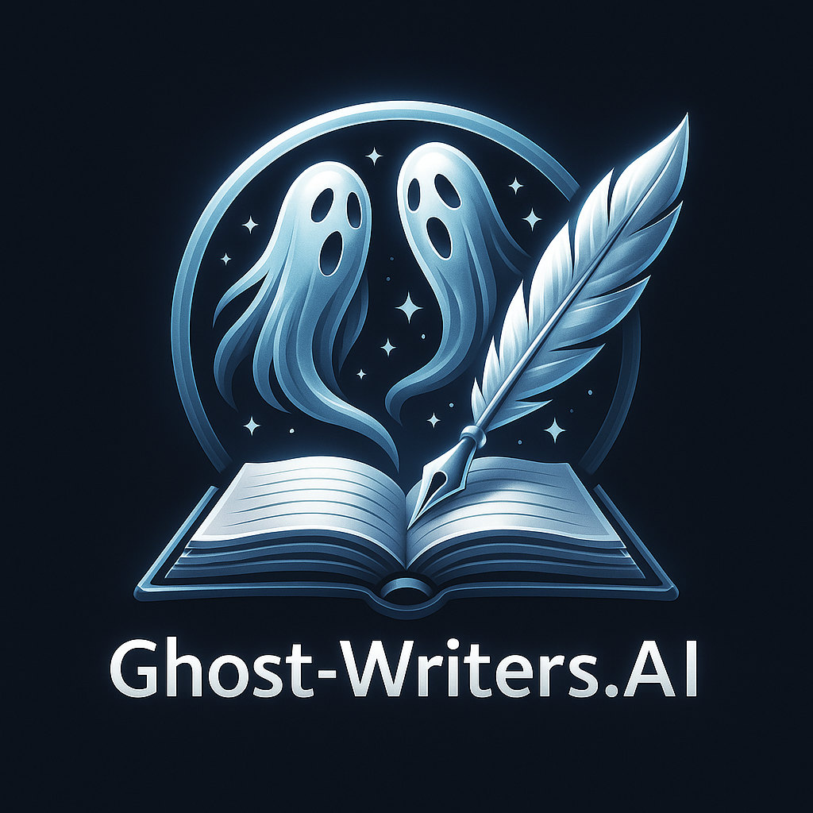

# 👻 Ghost-Writers.AI

### **Hackathon Details**

- **Hackathon Name:** LlamaCon Hackathon 2024
- **Location:** San Francisco, CA @ Shack15 / Cerebral Valley
- **Date:** May 3–4, 2024
- **Website/URL:** [LlamaCon Hackathon](https://cerebralvalley.ai/e/llamacon-hackathon-2025)
- **Objective:** Build an impactful, creative AI-powered tool within 24 hours, using sponsor tools like CrewAI, Groq, and Tavus.

# 

## Overview

**Ghost-Writers.AI** empowers creative individuals to build structured fiction using modular AI tools. We combine character cards, scene design, AI memory, and real-time storytelling to help writers collaborate with AI, not compete with it.

Our platform features an intuitive writing workspace backed by CrewAI agent teams, Groq's blazing-fast LLM inference, and Tavus-generated interactive writing coaches that provide personalized guidance.

## Table of Contents

1. [Motivation](#motivation)
1. [Features](#features)
1. [Tech Stack](#tech-stack)
1. [Setup and Installation](#setup-and-installation)
1. [How It Works](#how-it-works)
1. [Challenges](#challenges)
1. [Future Improvements](#future-improvements)
1. [Contributors](#contributors)
1. [License](#license)
1. [Contact](#contact)

## Motivation

Writing a novel is overwhelming for many creatives. They struggle with structure, consistency, and momentum. Ghost-Writers.AI lowers the barrier to storytelling by offering structured tools and an AI collaboration framework that assists — not replaces — the human voice.

Ghost-Writers.AI uniquely combines agent orchestration, narrative memory, and modular creation tools to truly empower fiction writers.

## Features

- **User Authentication:** Secure sign-in/sign-up with password hashing and salt for project ownership.
- **Project Dashboard:** Create and manage writing projects with metadata like genre, audience, and style.
- **3-Step Onboarding:** Guided setup for new projects with genre selection and writing coach assignment.
- **Character Cards:** Define characters with background, traits, and motivations with full CRUD operations.
- **Character Import:** Reuse shared character templates across projects with pre-built archetypes.
- **Scene Cards:** Build scenes with structured setting, mood, conflict, and character selection.
- **Timeline View:** Vertical timeline with drag-and-drop reordering of scenes to structure your narrative.
- **Scene Generation:** AI-powered scene drafting that respects character traits and narrative memory.
- **Rich Text Editor:** Full-featured editor with auto-save, version history, and real-time collaboration.
- **AI Memory:** Categorized memory system that tracks characters, world facts, plot points, and style notes.
- **Interactive Writing Coach:** Genre-specific Tavus-powered video coaches that provide personalized advice.
- **Conversation Transcripts:** Review and reference writing advice from your coaching sessions.
- **Research Assistant:** Genre-specific research suggestions to enhance scene authenticity.
- **Long-Form Export:** Generate structured prompts for external LLM use with all project context.
- **Comprehensive Error Handling:** Robust validation, error surfacing, and fallback mechanisms.

## Tech Stack

### Frontend
- **Framework:** Next.js 14 with App Router
- **Database:** Turso (SQLite-based, edge-ready database)
- **Styling:** Tailwind CSS + shadcn/ui components
- **Animations:** Framer Motion
- **Text Editing:** TipTap rich text editor
- **Drag and Drop:** DnD Kit
- **Icons:** Lucide React
- **Collaboration:** Y.js + WebSocket for real-time editing
- **Type Safety:** TypeScript
- **Validation:** Zod schema validation

### Backend
- **API Framework:** FastAPI (Python)
- **Agent Orchestration:** CrewAI
- **LLM Inference:** Groq API (OpenRouter fallback)
- **Video Generation:** Tavus API for interactive coaching
- **Database:** SQLite (dev), PostgreSQL (production)
- **Environment Management:** uv (via Homebrew)

## Setup and Installation

1. Clone the repository:

```bash
git clone https://github.com/your-repo/ghost-writers-ai.git
cd ghost-writers-ai
```

2. Install `uv` via Homebrew (MacOS):

```bash
brew install astral-sh/uv/uv
```

3. Sync environment dependencies:

```bash
uv sync
```

4. Add environment variables to `.env`:

```
GROQ_API_KEY=your-groq-api-key
TAVUS_API_KEY=your-tavus-api-key
CREWAI_API_KEY=your-crewai-key
TURSO_DATABASE_URL=your-turso-db-url
TURSO_AUTH_TOKEN=your-turso-auth-token
NEXTAUTH_SECRET=your-nextauth-secret
```

5. Start backend server:

```bash
cd backend
uv pip install fastapi uvicorn
uvicorn app.main:app --reload
```

6. Run frontend:

```bash
cd front-end/project
npm install
npm run dev
```

7. Access app at `http://localhost:3000`.

## How It Works

1. **User Authentication:** Sign up or sign in to access your writing projects.
2. **Project Creation:** Create a new project and complete the 3-step onboarding process.
3. **Character Development:** Create character cards with traits, motivations, and relationships.
4. **Scene Planning:** Build scene cards with setting, mood, conflict, and character selection.
5. **Timeline Organization:** Arrange scenes in a vertical timeline with drag-and-drop reordering.
6. **Scene Generation:** Submit scene setup → CrewAI agents generate scene drafts using Groq API.
7. **Memory Management:** AI automatically tracks important narrative elements across scenes.
8. **Writing Coach:** Interact with a Tavus-powered video coach for personalized writing advice.
9. **Research Assistance:** Get genre-specific research suggestions to enhance scene authenticity.
10. **Export and Share:** Generate structured prompts for external use with all project context.

## Challenges

- **Agent Coordination:** Structuring modular CrewAI agents to collaborate meaningfully.
- **Memory Handling:** Managing scene summaries across evolving narrative arcs.
- **Tavus Integration:** Implementing robust video generation and conversation APIs with proper error handling.
- **Real-time Collaboration:** Synchronizing editor state across multiple users with Y.js.
- **Frontend-Backend Sync:** Rapid linking of Next.js frontend to FastAPI endpoints.
- **Tight Deadline:** Focused on "working core" over feature sprawl.

## Future Improvements

- **Backend Completion:** Finish implementing remaining backend tickets for full functionality.
- **Scene Versioning:** Track all scene generations with history and restore capabilities.
- **Memory Recomputation:** Regenerate memory from scene text with diff visualization.
- **Auto-Generated Character Summaries:** Generate backstories or motivations from traits.
- **Writing Style Injection:** Inject style/persona metadata into generation for consistent tone.
- **Richer Worldbuilding Templates:** Add genre-specific templates (fantasy, sci-fi, etc.).
- **Multiplayer Collaborative Writing Rooms:** Enhance real-time collaboration features.
- **Genre-Specific AI Writing Personas:** Tailor AI assistance to specific writing styles.
- **Deeper Narrative Memory:** Improve memory management across 10,000+ words.
- **Admin and Dev Tools:** Add tools for testing and data management in development.

## Contributors

- **Colin Alexander** - Backend & AI Engineer ([GitHub](https://github.com/colinalexander))
- **[Frontend Teammate]** - Frontend Developer _(Looking for you!)_

## License

This project is licensed under the Apache 2.0 License.

## Contact

- **Discord:** alexander61239
